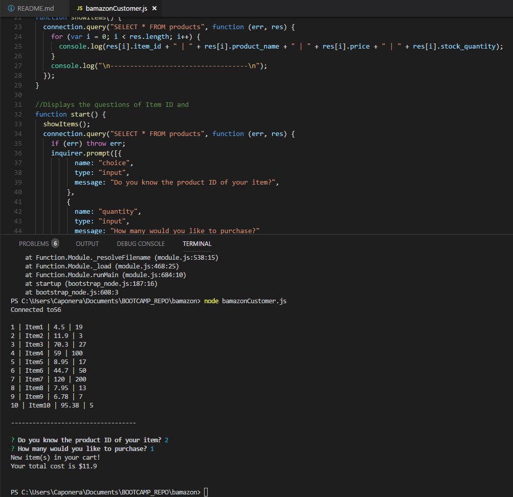
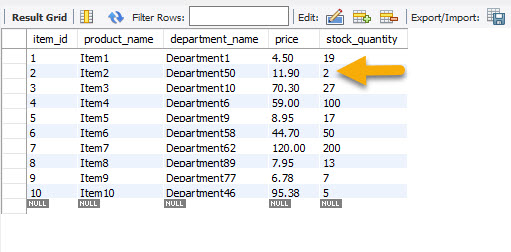
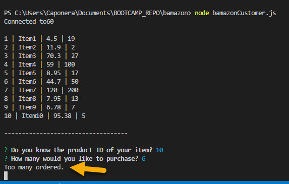

# bamazon
 This app takes in orders from customers and depletes stock from the store's inventory. 

# How to use?
bamazon is used from the command line and needs a MySQL database connected to it. Navigate to the folder containing the 'bamazonCustomer.js' file and run the program with 'node bamazonCustomer.js'.

You will be introduced to a list of items to choose from with prices and quantities.

Choose which item you would like to purchase and how much.

You will be informed in the order can be completed with a price and message.

Database updates immediately.

If there is not enough quantity you will recieve a message stating that.

